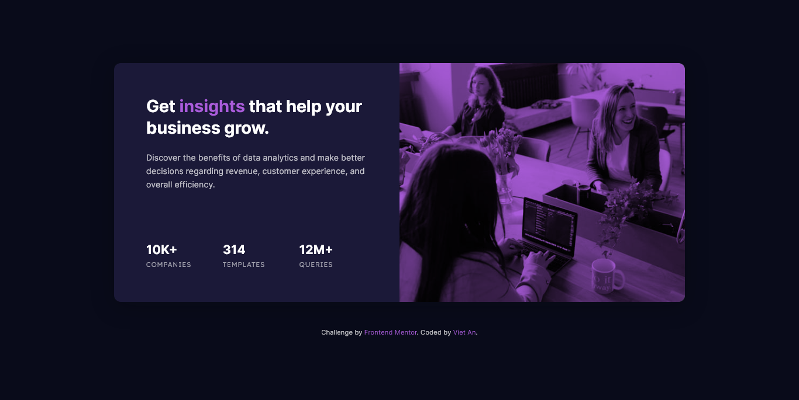

# Frontend Mentor - Stats preview card component solution

This is a solution to the [Stats preview card component challenge on Frontend Mentor](https://www.frontendmentor.io/challenges/stats-preview-card-component-8JqbgoU62). Frontend Mentor challenges help you improve your coding skills by building realistic projects.

## The challenge

Users should be able to view the optimal layout depending on their device's screen size

## Screenshot

## Links

-   [Live Website](https://vietan0.github.io/FM-stats-preview-card-component/)
-   [Solution Page on Frontend Mentor](https://www.frontendmentor.io/solutions/stats-preview-card-component-using-plain-css-sxez4tDRQ)

## Built with

-   Semantic HTML5 markup
-   CSS Variables
-   Flexbox
-   CSS Grid

## What I learned

-   [Pseudo elements don't work on &lt;img&gt;](https://stackoverflow.com/questions/5843035/does-before-not-work-on-img-elements/5843164#5843164)
-   [CSS transform doesn't work on inline elements](https://developer.mozilla.org/en-US/docs/Web/CSS/transform)
-   You can blend images in code with [`mix-blend-mode`](https://developer.mozilla.org/en-US/docs/Web/CSS/mix-blend-mode)

## Useful resources

-   [Responsive images - MDN](https://developer.mozilla.org/en-US/docs/Learn/HTML/Multimedia_and_embedding/Responsive_images) - Help me switch images for different screen sizes without using media queries.

## Author

-   Frontend Mentor - [@vietan0](https://www.frontendmentor.io/profile/vietan0)
-   Linkedin - [@vietan](https://www.linkedin.com/in/vietan/)
